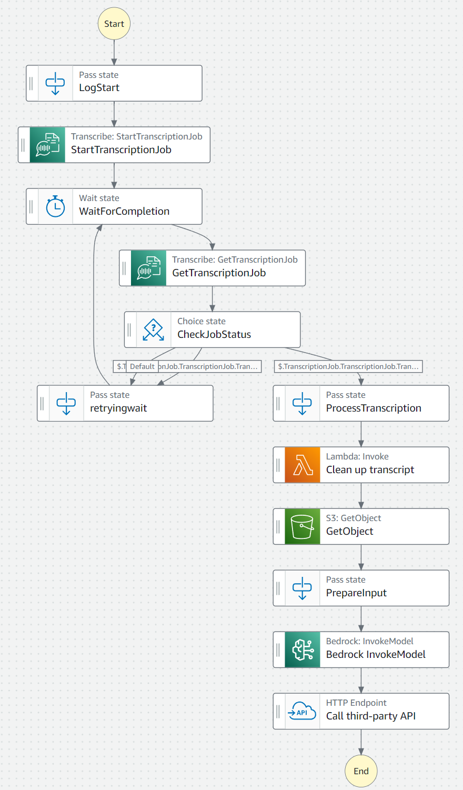

# AWS-Step-Function
AWS step function that turns a .mp3 into a news article using AWS transcribe, AWS Lambda and AWS Bedrock. Please see https://github.com/Audio-to-Blog/webaudioblog for the main documentation of the project.

Brief descriotion of the step function:
1. Transcript Job Started and waited.
2. Transcription fetched.
3. Transcription cleaned and the appropriate file is fetched from S3.
4. File prepared for input to LLM.
5. Amazon Bedrock LLAMA invoked.
6. API called of rust web service to return response.
7. End.
